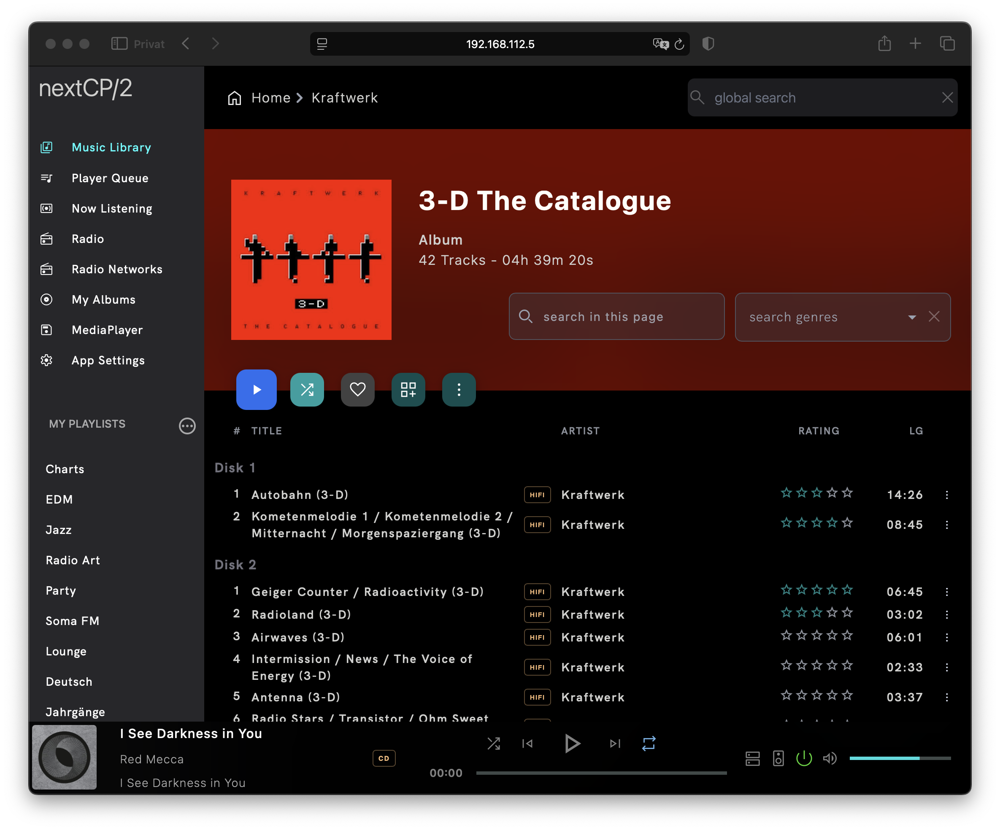
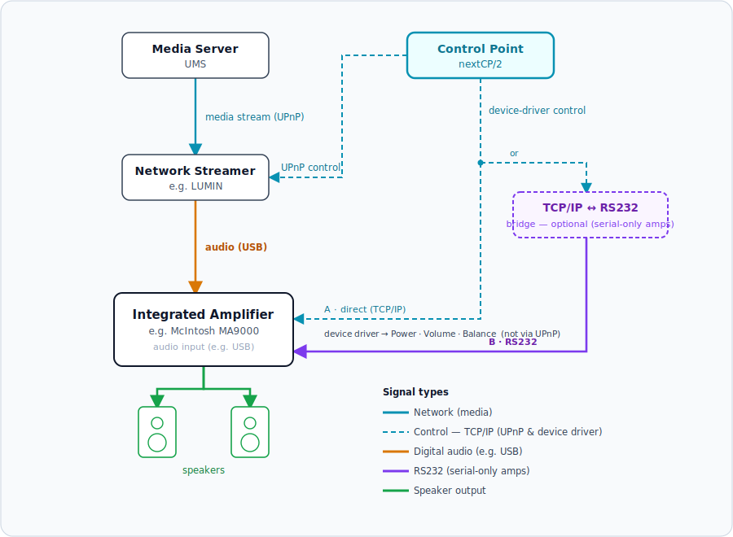

# nextCP/2

NextCP/2 is a web-based UPnP control point written in Java and Typescript.



Documentation and installation instructions are available at [GitHub Pages](https://sf666.github.io/nextcp2).

## running the application

Download a platform release or the docker image and start it. 

By default the application will start on the current interface on port `8085`.

Open your browser and connect to the application:

```
http://localhost:8085
```

If nextcp runs on a server or remote machine, replace `localhost` by the IP address of your device.


## system requirements

- minimum JDK 25
- maven 3.8
- yarn
- GIT client

## browser requirements

- Web browser needs support for server-sent-events. Current Chromium based browser should work.

# Developer notice

## Install maven dependencies

nextCP/2 depends on two custom forks that are **not published to Maven Central**
and must be built from source into the local maven repository before building
nextCP/2 itself:

| Fork                                                     | Maven artifact          | git tag                       |
| -------------------------------------------------------- | ----------------------- | ----------------------------- |
| [ik666/jupnp](https://github.com/ik666/jupnp)            | `org.jupnp:*`           | `<jupnp.version>`             |
| [sf666/musicbrainz](https://github.com/sf666/musicbrainz)| `de.sf666:musicbrainz`  | `musicbrainz-<version>`       |

Call the helper script to install both:

```bash
./build_dependencies.sh
```

The script is version-driven from a **single source of truth**: it reads the
`jupnp.version` and `musicbrainz.version` properties from `backend/pom.xml`,
checks out the matching git tag of each fork (jUPnP tag = the version, MusicBrainz
tag = `musicbrainz-` + version), and installs them locally. The same script runs
in CI, so local and release builds resolve identical versions.

To bump a fork version, change it in **one** place and create the matching tag:

1. Edit `<jupnp.version>` / `<musicbrainz.version>` in `backend/pom.xml`.
2. In the fork repository, tag the desired commit (e.g. `git tag 3.0.6.ik` or
   `git tag musicbrainz-1.4.3`) and push the tag.

`build_dependencies.sh` and the dependency declarations then follow automatically —
there is no second place to keep in sync.

### automated build

- call `build.sh`

Build artifacts are located in the `build` directory.

### manual building

```diff
! The frontend has to be packaged before the backend is build.
```

#### build frontend

```bash
cd frontend/nextcp-ui
./ng build
```

UI will be build into the backend folder : `backend/nextcp2-runtime/src/main/resources/static`

```diff
! Since this directory contains generated content, do not add it to the repository.
```

#### build backend

```bash
cd backend/
mvn clean
mvn install
mvn package
```

## build artifact

Build artifacts are located in the maven `target` directories. 

- The runnable application jar is build in the module `backend/nextcp2-assembly/target`
- Device Driver are build in the modules below `backend/nextcp2-device-driver`

### main application

After a successful build, the main application build artifact will be located here `backend/nextcp2-assembly/target`

### McIntosh device driver

A **device driver** lets nextCP/2 control the device your streamer feeds its audio into — typically an integrated amplifier — and take over its **power, volume and balance** from the UI. These are hardware functions of the amplifier that UPnP alone cannot reach.



**Typical setup.** A network streamer (e.g. a LUMIN) is connected to an input of the amplifier (e.g. a McIntosh MA9000) — for example over USB — and feeds it the audio; the amplifier drives the speakers. How nextCP/2 reaches the amplifier depends on the device:

- **network-controllable amplifiers** are driven **directly over TCP/IP**;
- **serial-only amplifiers** (RS232) need a small, **optional** TCP/IP&nbsp;&#8596;&nbsp;RS232 bridge (e.g. a __USR-TCP232-302__) that puts the serial port on the network. The bundled McIntosh driver uses this path.

Once a device driver is configured:

- the **volume slider** in the UI controls the **amplifier** instead of the streamer (the audiophile path);
- the **power button** likewise targets the amplifier;
- the streamer can optionally be forced to **100 %** so all volume control happens in the amplifier;
- default **volume** and **balance** can be applied automatically on power-on.

Configure it in the app under **App Settings → Renderer configuration → Device driver** (see the [documentation](https://sf666.github.io/nextcp2/user_interface/app_settings/)).

Current implemented features:

- power control
- volume control
- input source control

After a successful build, the device driver (tested with McIntosh MA9000 and MA12000 amplifier) is located here: `backend/nextcp2-device-driver/nextcp2-ma9000/target/`.


## config file

nextCP/2 stores its state (config, database, logs, transcode cache) in a **data directory**.

If the environment variable `NEXTCP_DATA` (or the system property `-Dnextcp.dataDir`) is set, it is **authoritative**: the config is read from — or generated into — that directory, ignoring the locations below. This is what the Docker image uses (`NEXTCP_DATA=/nextcp2_data`, mounted as a volume so settings survive restarts).

Otherwise the config file `nextcp2config.json` is looked up in this order:

1. file provided by system-property `configFile` (`-DconfigFile=/path/nextcp2config.json`)
2. the platform-specific data directory (see below)
3. `/etc/nextcp2/nextcp2config.json`
4. `USER_HOME/nextcp2config.json`
5. `WORK_DIR/nextcp2config.json`

If none is found, a default config is generated in the resolved data directory (the `NEXTCP_DATA` override, or the platform default) and picked up again on the next start:

| OS            | default data directory                    |
| ------------- | ----------------------------------------- |
| macOS         | `~/Library/Application Support/nextcp2`   |
| Windows       | `%APPDATA%\nextcp2` (fallback `~\nextcp2`) |
| Linux / other | `$XDG_CONFIG_HOME/nextcp2` or `~/.config/nextcp2` |

Inside the data directory the app creates the sub-directories `logs/`, `upnp_code/` and `tmp/` (the streaming-proxy pre-transcode cache), writes a `logback.xml` whose `LOG_DIR` points at `logs/`, and keeps the H2 database in the data-dir root.

Two further environment variables seed the **generated default config only** (they are ignored once a config exists, so they never override user-changed values):

- `NEXTCP_LIB` / `-Dnextcp.libDir` — device-driver library directory (`libraryPath`). The Docker image sets this to `/nextcp2/lib`, where the bundled MA9000/MA12000 driver ships.
- `NEXTCP_PORT` / `-Dnextcp.port` — HTTP listen port (`embeddedServerPort`, default `8085`).
- `NEXTCP_BIND_INTERFACE` / `-Dnextcp.bindInterface` — UPnP / stream-server network interface (`upnpBindInterface`, e.g. `eth0`). When unset in a Docker/data-dir setup, the host's primary interface is auto-detected.

## debugging

For debugging within an IDE start the backend first. The main Spring-Boot startup class is

```
backend/nextcp2-assembly/src/main/java/nextcp/NextcpApplicationStartup
```

For having a frontend build, `yarn` has to be installed in the build environment.

To start the front-end in Visual Studio Code switch to TERMINAL, change into the directory `nextcp2/frontend/nextcp-ui` and start the front-end by typing

```
yarn start -c dev
```

Launch your favorite chromium browser from the Visual Studio Code debug perspective.

## code generation

Generatied classes are located in the package `codegen` within the maven module `nextcp2-codegen`.

### DTO

DTOs for Java and Typescript are generated to keep data exchange between the rest and SSE interface (Java) consistent with the consuming Typescript code.

#### Java DTOs

The class `DtoModelGen` generates Java-DTO classes configured by the file `dto.yaml` located in the resource folder `src/main/resources/yaml`.

This file has many elements of

```
[CLASS_NAME]:
    [PROPERTY]: [TYPE]
```

Call `DtoModelGen` each time you modify the yaml file. Generate the file into the maven project `nextcp2-modelgen` in the package `nextcp.dto` by pointing to this absolute path as first parameter.

```diff
! ATTENTION: Never modify the generated DTOs files since changes to them will be overwritten by the next call to the generator.
```

#### Typescript DTOs

After generating Java DTOs, Typescript DTO's are automatically generated by the maven build process.

To manually start the Typescript DTO generation, enter the maven project `nextcp2-modelgen` and call `mvn process-classes`.

Typescript DTO's will be generated in the file `nextcp-ui/src/app/service/dto.d.ts`.

```diff
! ATTENTION: Never modify the generated DTO file since changes will be overwritten by the next maven build.
```

### UPnP services

If activated in the configuration file, java code (service classes, input and output classes, event consumer) will be generated for all discovered UPnP services. The generated code uses [jupnp](https://github.com/jupnp/jupnp) as UPnP stack.
